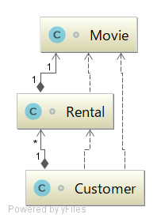

コードで学ぶモデルのリファクタリング
====================================

モデリングフォーラム 2017 のワークショップ用のプロジェクトです。

## モデリングフォーラム 2017

#### 開催日　2017年11月10日(金)
#### イベント内容

https://umtp-japan.org/event-seminar/6924 

## ワークショップの概要

コードのリファクタリングは、設計改善であると同時にモデルの改善活動です。
このワークショップでは、コードをリファクタリングとモデルの変化の様子を、手を動かしながら体験します。

### 環境と事前準備

説明は、IntelliJ Idea  Ultimate版で行います。

この環境を持ち込める方は、持ち込みをお願いいたします。
このリポジトリの内容をダウンロードの上、ローカルでの動作確認をお願いします。

環境を持ち込めない方は、他の参加者の環境で協同作業をしていただく形になります。

IntelliJ Idea Ultimate版以外の環境を持込む場合も支障はございません。
但し、説明内容との差異や、操作方法についてのサポートはいたしかねますので、あらかじめご了承ください。

## ワークショップの進め方

### 概要説明

モデルを３つの表現方法と、その組み合わせ方について、説明します。
（自然言語／クラス図／プログラミング言語）

### （前半）サンプルコードの初歩的なリファクタリング

コードをわかりやすく改善するための、リファクタリングの基本を step by step でやってみます。

各stepごとに、リファクタリングの前と後で、モデルがどのように変化するかを確認しながら進めます。

### （後半）より深い理解のためのリファクタリング

コードで明示的に表現できていない暗黙の業務ルールの発見と、明示的なコード表現にチャレンジしてみます。

## 初期のモデル

